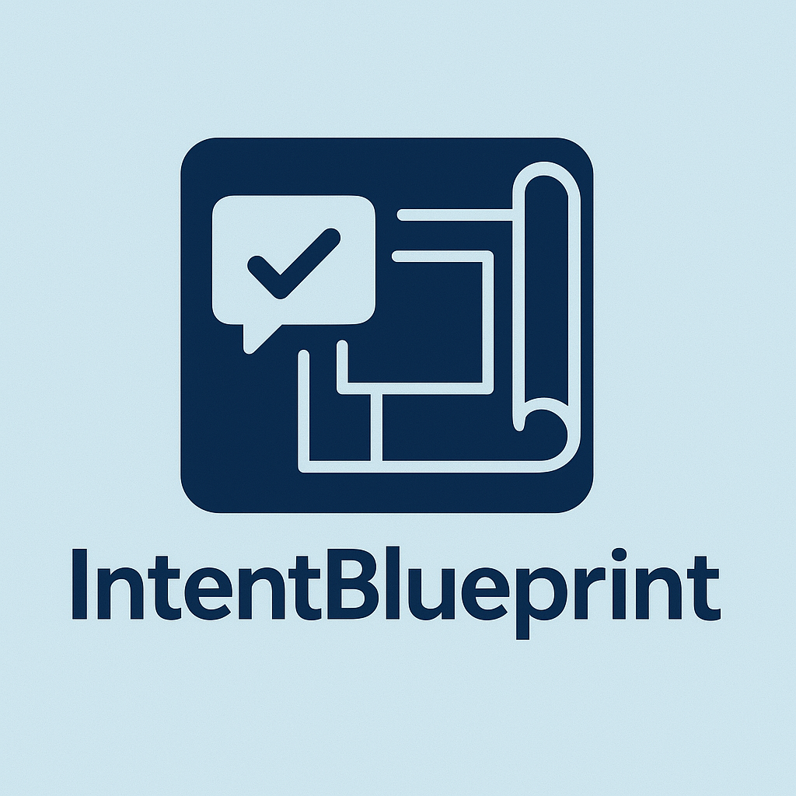

# IntentBlueprint: A Standard for Defining Project & Component Intent

**Status:** Version 1.0 - Stable Definition

**License:** Proprietary

**Last Updated:** 14-04-2025

## Overview

IntentBlueprint provides a standardized, yet flexible, template for articulating the core intent, goals, and scope of software projects or their individual components. Born from the need for clear, early-stage documentation, especially for projects hosted on platforms like GitHub, it establishes a foundational understanding before significant code is written.

Files created by users following this standard are encouraged to use the **`.iblueprint`** or the shorter **`.intb`** extension.

The structure promotes clarity and aligns with principles from Computer Science and Analysis & Systems Development, emphasizing modularity and well-defined boundaries. It's designed primarily for technical teams (developers for themselves or colleagues), automated tooling, and AI analysis, while remaining human-readable and human-focused.

## IntentBlueprint's Niche & Purpose

While the need for early project definition is well-known, IntentBlueprint occupies a specific niche compared to other documentation types:

* **Not RUP/Charter:** It's deliberately lighter and more developer-focused than broader, often business-centric documents like RUP Vision docs or Project Charters.
* **Not Just a README:** It's more structured and internally focused than a typical public-facing README, designed to capture specific intent details before broader documentation exists.
* **Not a Business Canvas/Pitch:** It goes beyond the lean scope of a pitch or business canvas, providing more structure for technical project definition.
* **Precursor to HLD:** It serves as foundational input *before* detailed High-Level Design (HLD) documents are drafted. It clarifies the *why* and *what* before the *how*.

**Lifecycle & Role:**
IntentBlueprint is envisioned as **early-stage documentation**. It acts as a foundational artifact or placeholder to ensure clarity from the very beginning. Its purpose is often served once more detailed specifications, designs, or comprehensive documentation are created. Therefore, an IntentBlueprint file might be:
* **Absorbed:** Its content can be migrated or integrated into larger design documents or requirements specifications.
* **Superseded/Archived:** It may be replaced by more detailed artifacts once the project matures.
* **Retained:** For components or smaller projects, it might remain the primary definition of intent.

Its existence simplifies the creation of later documentation by providing a clear, agreed-upon starting point.

## Purpose & Benefits (Why Use IntentBlueprint?)

Adopting this model helps:

* **Clarify Vision & Foster Alignment:** Ensures a common understanding of the "why" and "what".
* **Validate Need:** Helps assess if the project/component is truly necessary by clearly defining the problem it solves.
* **Define Scope Rigorously:** Establishes clear boundaries and interfaces, crucial for managing project scope and component interactions.
* **Improve Early-Stage Documentation:** Provides a consistent format for initial project definition, aligning with best documentation practices.
* **Complement Code Understanding:** Reduces reliance on potentially inconsistent or overwhelming code comments, especially in large projects. Developers can quickly grasp the core purpose by reading the concise IntentBlueprint or requesting an AI summary, easing the understanding of complex or poorly documented codebases.
* **Enhance Onboarding:** Offers a concise, high-level overview for new contributors or stakeholders.
* **Support Modularity:** Equally applicable for defining entire systems or specific, reusable components within them.
* **Enable Automation & Analysis:** Creates structured data potentially usable for automated reporting, AI-driven project analysis, or generating documentation skeletons.

## The IntentBlueprint Model & Template Files

The detailed structure, section explanations, and official templates are provided in multiple formats within this repository. Choose the one that best suits your needs:

* ➡️ **[View Complete Specification & Template (`.md`)](./BLUEPRINT_TEMPLATE.md)**
    * **Content:** The **complete** specification. Includes the full template structure, all optional markers (`§`), detailed explanations for each section, and usage examples. Ideal for fully understanding the standard.
    * **Compatibility:** Best compatibility with standard Markdown tools.

* ➡️ **[View Practical Template (`.iblueprint`)](./BLUEPRINT_TEMPLATE.iblueprint)**
    * **Content:** A **practical template** containing the full structure with optional markers (`§`). Omits the extensive commentary and examples found in the `.md` file. Suitable for direct use when creating new intent documents.
    * **Compatibility:** Requires editor configuration for optimal Markdown viewing (see Usage Notes).

* ➡️ **[View Minimalist Template (`.intb`)](./BLUEPRINT_TEMPLATE.intb)**
    * **Content:** A **minimalist template** containing only the essential, non-optional section headings. Ideal for very quick drafting or when focusing solely on the core mandatory elements.
    * **Compatibility:** Requires editor configuration for optimal Markdown viewing (see Usage Notes).

**Important Note on Template Guidance:**
Please note: Each template file (`.md`, `.iblueprint`, `.intb`) includes an embedded comment regarding the design, authored by Protoncracker (found on GitHub /Protoncracker). This comment serves both for creator attribution and as a starting point for developers who may be unsure how to effectively use or adapt the template. Users seeking guidance on creating or editing IntentBlueprint documents are encouraged to consult this embedded note within the templates themselves.

**Note on Formats & Future:**
Currently (Version 1.0), the `.md` file contains the full definition, while `.iblueprint` and `.intb` offer ready-to-use templates derived from it. Future versions of the IntentBlueprint standard *may* introduce features or syntax specific to the `.iblueprint` and `.intb` formats, potentially extending beyond standard Markdown capabilities.

### Concrete Examples

To see how IntentBlueprint can be applied in practice, several illustrative examples (using the `.intb` and `.iblueprint` formats) are provided in the `/examples/` directory within this repository. These demonstrate application across various scales and types:

* **[`/examples/Google_Intent.iblueprint`](./examples/Google_Intent.iblueprint)**: A *hypothetical* application to outline the intent of a massive, multifaceted entity like Google (suited for the more detailed `.iblueprint` format).
* **[`/examples/ExifTool.intb`](./examples/ExifTool.intb)**: A *hypothetical* example for a well-known, focused software utility like ExifTool (using the concise `.intb` format).
* **[`/examples/AuthComponent.iblueprint`](./examples/AuthComponent.iblueprint)**: A *hypothetical* example detailing the intent for a specific software component (e.g., an authentication module) within a larger system.
* **[`/examples/Thrintur_CombatCalculator.intb`](./examples/Thrintur_CombatCalculator.intb)**: A *hypothetical* example for a specific game logic component, like a combat calculator for the Thrintur project.
* **[`/examples/SimpleBackupScript_Intent.intb`](./examples/SimpleBackupScript_Intent.intb)**: A *hypothetical* example outlining the purpose of a straightforward utility script.
* **[`/examples/WeatherAPI.iblueprint`](./examples/WeatherAPI.iblueprint)**: A *hypothetical* example defining the intent behind a web service API.

Reviewing these can provide practical insight into filling out the template for different project needs.

## Section Breakdown (Summary)

*(Refer to [./BLUEPRINT_TEMPLATE.md](./BLUEPRINT_TEMPLATE.md) for full details)*

1.  **Core Intent / Purpose:** The fundamental rationale ("Why") and envisioned solution ("What").
2.  **Goals / Key Objectives:** High-level success targets for the defined scope.
3.  **§ Success Metrics:** How achievement of goals will be measured (optional).
4.  **Scope:** Defines responsibilities, boundaries, and interfaces (In/Out).
5.  **§ Dependencies:** Lists crucial external reliance points (optional).
6.  **§ Key Assumptions:** Surfaces underlying beliefs critical to the plan (optional).
7.  **§ Target Audience / Users / Consumers:** Identifies who interacts with the code (optional).
8.  **§ Potential Approach / Technology / Design Notes:** Captures technical direction and implementation ideas (optional).

## Usage

* **Choose a Template:** Start with `.iblueprint` (full structure) or `.intb` (minimal structure). Refer to `.md` for detailed explanations.
* **Create Early:** Generate a `.iblueprint` or `.intb` file at the start of a project or component design phase.
* **Be Concise:** Emphasize high-level intent over implementation minutiae.
* **Adapt Scale:** Utilize the structure for both large systems and small modules.
* **Version Control:** Store the file in your repository (e.g., Git) and track its evolution.
* **Filename Convention:** Common practice is `INTENT.[extension]`, `[ProjectName].[extension]`, etc. (e.g., `AuthModule.intb`).
* **Editor Configuration (for `.iblueprint`/`.intb`):** Users may need to map the extension to Markdown in their editor (e.g., in VSCode's `settings.json`) for optimal viewing/syntax highlighting, especially for the current version.

## Potential Applications

* **Development Teams:** Shared understanding, component interface definition, onboarding, basis for task breakdown, initial project need validation.
* **Project Management:** Initial scope validation, technical stakeholder communication, reference point for progress against core goals.
* **AI & Automation (Including Custom Tooling):** Structured input for:
    * Custom tools parsing multiple `.intb`/`.iblueprint` files to generate project portfolio summaries or high-level management overviews.
    * AI-powered code/project analysis tools.
    * Automated generation of documentation stubs or reports.
    * Consistency checks across multiple project intent files.
    * Feeding data into knowledge base systems.

## Contributing

As this project is currently under a proprietary license, direct contributions are not open at this time. Suggestions or feedback may be considered via [Specify preferred feedback channel - e.g., GitHub Issues, if enabled, or contact info].

## License

**Proprietary.**

© 2025 Protoncracker. All rights reserved.

This IntentBlueprint standard definition, including the template files (`BLUEPRINT_TEMPLATE.md`, `BLUEPRINT_TEMPLATE.iblueprint`, `BLUEPRINT_TEMPLATE.intb`), may be referenced for personal or internal use to create your own intent documents. Reproduction, modification, or redistribution of the standard definition itself requires explicit prior written permission from the copyright holder.

Projects *using* the IntentBlueprint model (i.e., creating their own `.iblueprint` or `.intb` files detailing their specific project intent) can and should be licensed independently under terms chosen by their respective authors.
